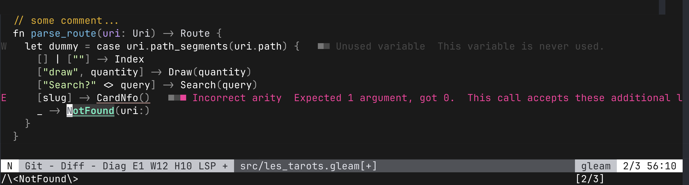

# minimal_gleam
```
8888888b.   .d8888b.                888
888   Y88b d88P  Y88b               888
888    888      .d88P               888
888   d88P     8888"   8888b.   .d88888 88888b.d88b.   .d88b.
8888888P"       "Y8b.     "88b d88" 888 888 "888 "88b d8P  Y8b
888 T88b   888    888 .d888888 888  888 888  888  888 88888888
888  T88b  Y88b  d88P 888  888 Y88b 888 888  888  888 Y8b.
888   T88b  "Y8888P"  "Y888888  "Y88888 888  888  888  "Y8888
```
minimal, readable easy on your eyes Neovim colorscheme

no plugin, just under 130 lines, <br>
simple, easy to extend to your like.<br>
and yes it's gleam lang friendly ;)

## Quick Start

*place config in:*

```~/.config/nvim/colors/minimal_gleam.lua```

*place in your init.lua these:*

`vim.o.termguicolors = true`

`vim.cmd("colorscheme minimal_gleam")`




